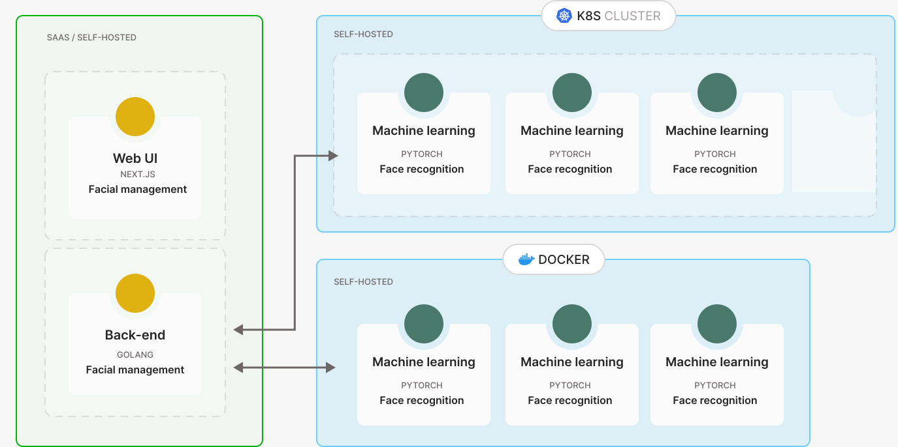

# uuft.ai (facial access control)

This project is a facial access control system that allows you to setup a facial biometric permission application to provide access to various applications, IoT devices, IOs or other types of access control. The application is called `uuft` which is Ghent dialect for `head` and relates to concept the face recognition.

This project is currently under construction, so expect some brutal changes coming up ;)

## Demo

To be completed

## How does it work?

Uuft is a web based application that allows you to build and administer the biometrics of people within your organisation or group that requires biometric access through face detection. The application allows you to:
- Create an hierarchy of user accounts
- Collection of biometric data from specific users
- Assign access to various applications (APIs) and or other IoT devices through the concept of plugins
- Create custom landing pages for specific scenarios (entering a meeting room, open postbox, request access to an application, and more).

Next to the web based application, a machine learning workload is running in the background allowing to retrain or add more faces to the face recognition model on the fly, and more:
- On the fly updating of new biometric data and user accounts.
- Isolation of biometric data on your infrastructure (you own the biometrics, nothing is in the cloud)
- Ability to scale through Kubernetes and the NVidia operator.
  
 ## Designs

You can view the designs and mockups for our project on Figma. Click the link below to access them:

[View Figma Designs](https://www.figma.com/file/n6MKXziHYC69485QCvtW1g/Facial-Access-Control---Luis%2FGlenn-%26-Kilian%2FJonas?type=design&node-id=0%3A1&mode=design&t=HiWxICFMNlHRh4jI-1)

## Architecture

A high-level architecture is visualised below, showing how the different components in this project are communicating. The idea is that each component `ui`, `api` and `ml` can be installed where you want. For example you could deploy the `ui` and `api` on a cloud provider, and self-host the `ml` part on your own private cloud or edge deployment to make sure you are owning the biometric data.

## UI (front-end)

The front-end makes use of the [Next.js](https://nextjs.org/) framework. [Storybook](https://storybook.js.org/)
 will be used to keep track of and test our UI components.

## API (back-end)

The back-end or API is written in Golang, and defines specific methods to persist data and call the face recognition model. It has various API methods to create new users, assign permissions and access control, and (re)train and interfere with the facial recognition model.

## ML (face recognition)

To be documented

## Kerberos.io (camera networks)

Uuft is focussing on a very specific usecase `face recognition`, however to operate in production it requires a camera infrastructure (`surveillance cameras` or `ip cameras`) to be processed. For example you might use an entrance camera to track incoming employees.

 Managing a camera network comes with it's own challenges and requires a solution on it's own: onboarding cameras, storing recordings, livestreams, alerts, and more. Bottom line it's very complex to manage various cameras brands and make it stable and resilient.

To overcome the complexity of managing a multitude of camera networks, we are using the [`kerberos.io`](https://github.com/kerberos-io) stack. The idea is that we will deploy `kerberos.io` in one or more networks, consolidate all the cameras in a single distributed environment, and then target `uuft`'s facial access control solution to one or more cameras.

## Custom applications

You might not always require surveillance or ip cameras for your usecase. For example you can embed facial recognition into your own application, for example using your smartphone, tablet or working device (laptop). 

A few example usecases are:

- Blacklist: notify if a person was detected which is added to a blacklist.
- Meeting room verification: validate if the user in front of the door has made a booking into the system. On validation of the person, the meeting room door unlocks.
- Welcome desk: a kiosk screen at the entrance of a building, who can recognise your profile and shows relevant updates for you (urgent messages, next meeting, etc).
- Automated locker: open a personal locker or mailbox.

As described above you might already have your own usecase, for which you would like to integrate facial recognition in. By using `uuft` you can rely on a stable and user-friendly system that scales, and do not have to build a complete facial recognition system from scratch. Using `apis` and a management pane you can quickly onboard new facial biometrics and provide access to your solution in a matter of seconds.
 
## Contributors

This project exists thanks to all the people who contribute.

