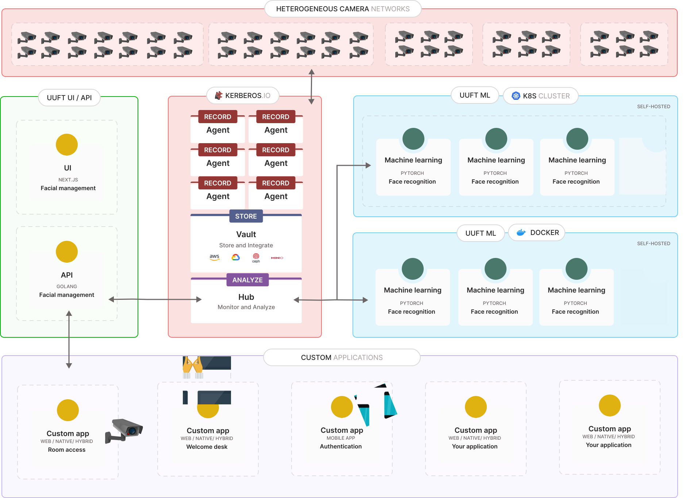

# uuft.ai (facial access control)

This project is a facial access control system that allows you to setup a facial biometric permission application to provide access to various applications, IO devices or other types of access control.
The application is called `uuft` which is Ghent dialect for `head` and relates to concept the face recognition.

This project is currently under construction, so expect some brutal changes coming up ;)

## Demo

To be completed

## How does it work?

Uuft is a web based application that allows you to build and administer the biometrics of people within you organisation that requires biometric access through face detection. The application allows you to:
- Create an hierarchy of user accounts
- Collection of biometric data from specific users
- Assign access to various applications (APIs) and or other IoT devices through the concept of plugins
- Create custom landing pages for specific scenarios (entering a meeting room, open postbox, request access to an application, and more).
- ...

Next to the web based application, a machine learning workload is running in the background allowing to retrain or add more faces to the face recognition model on the fly, and more:
- On the fly updating of new biometric data
- Isolation of biometric data on your infrastructure (you own the biometrics, nothing is in the cloud)
- ....
  
 ## Designs

You can view the designs and mockups for our project on Figma. Click the link below to access them:

[View Figma Designs](https://www.figma.com/file/n6MKXziHYC69485QCvtW1g/Facial-Access-Control---Luis%2FGlenn-%26-Kilian%2FJonas?type=design&node-id=0%3A1&mode=design&t=HiWxICFMNlHRh4jI-1)

## Web app (ui)

The web based application will make use of the [Next.js](https://nextjs.org/) framework. [Storybook](https://storybook.js.org/)
 will be used to keep track of and test our UI components.

## Back-end (api)

The back-end or API is written in Golang, and defines specific methods to persist data and call the face recognition model.

## Face recognition (ml)

## Architecture

A high-level architecture is visualised below, showing how the different components in this project are communicating. The idea is that each component `Web app`, `Back-end` and `Face recognition` can be installed where your prefer. For example you could deploy the `Web app` and `Back-end` on a cloud provider, and self-host the `Face recognition` on your own private cloud or edge deployment to make sure you are owning the biometric data.

## Contributors

This project exists thanks to all the people who contribute.

